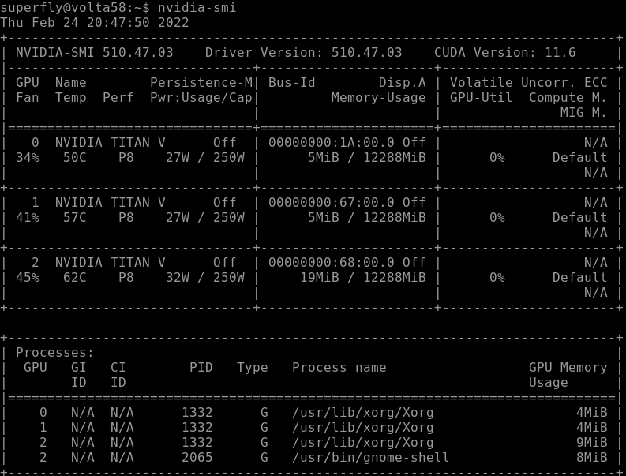
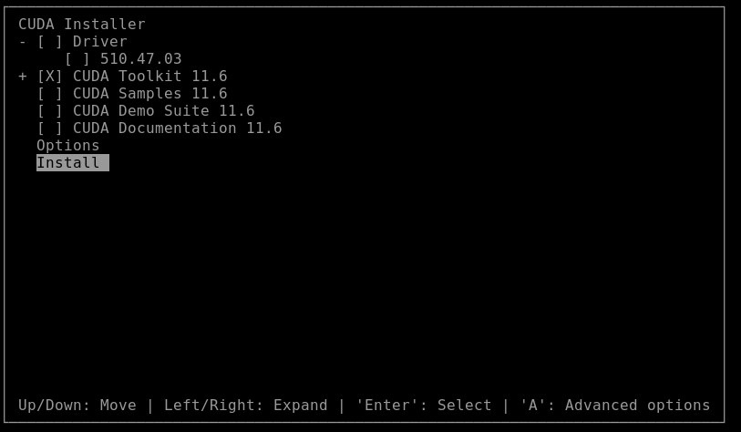
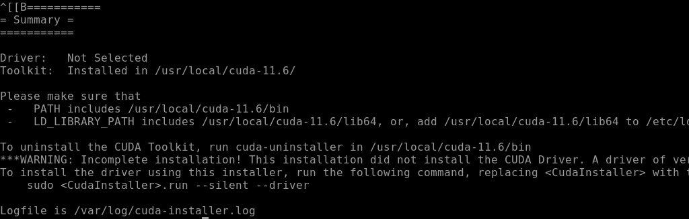

# Gromacs Configuration With CUDA Toolkit in Ubuntu 20.04 LTS

Author: Amir Fawwaz

Affliation: Twistcode® Technologies Sdn. Bhd., Cyberjaya, Malaysia

Published: 26/2/2022

## Introduction

[GROMACS](https://www.gromacs.org/) is a molecular dynamics application designed to simulate Newtonian equations of motion for systems with hundreds to millions of particles. GROMACS is designed to simulate biochemical molecules like proteins, lipids, and nucleic acids that have a lot of complicated bonded interactions.

GROMACS runs up to 3X faster on systems accelerated with NVIDIA GPUs than CPU-only systems*, enabling users to run molecular dynamics simulations in hours instead of days.

## Objective

This note is to capture the setup that have been done to make it work and reproducible for other researcher or system administrator.

## Software Prerequisite

- CMake
- NVIDIA CUDA®*
- GCC*
- MPI (Optional. Use if the multi-node version is needed).

> *It’s recommended to use a recent CUDA version (currently 11.6), and the most recent gcc version, supported by the given CUDA version.

## The setup
### Relevant libraries and CUDA

1) Check whether nvidia driver is already install on your OS. To check, type the following in the terminal:

```bash
nvidia-smi
```




and you can see the like figure above.

2) if command `nvidia-smi` does not giving any ouput, you can install nvidia driver by type the following in the terminal:

```bash
sudo apt-get install nvidia-driver-510
```

Once done, repeat step (1)

3) Now, let's install nessecary library first related to gromacs. Type the following in the terminal:


```bash
sudo apt-get install -y python3-dev libopenmpi-dev openmpi-bin python3-mpi4py build-essential libfftw3-dev
```

4) install cmake by typing the following:

```bash
sudo snap install cmake --classic
cmake --version
```

5) Now, let's install CUDA 11.6 Toolkit. Go to folder Downloads and type the following in the terminal:

```bash
wget https://developer.download.nvidia.com/compute/cuda/11.6.1/local_installers/cuda_11.6.1_510.47.03_linux.run
chmod +x cuda_11.6.1_510.47.03_linux.run
sudo ./cuda_11.6.1_510.47.03_linux.run
```

In the terminal, when ask `Abort` or `Continue`, select `Continue` and press `Enter`. Then `accept` license agreement. Then , uncheck all except `CUDA Toolkit 11.6`, select `Install` and press `Enter`. Choose `Upgrade all` to override any existing CUDA Toolkit (possibly the old one)





Once you get the following, meaning, CUDA is successfully installed!





6) To make our OS `know` where CUDA is, edit `.bashrc` at your home directory and append the following at the end of file. Logout and Login again.

```bash
# cuda setup

export CUDA_HOME=/usr/local/cuda-11.6
export LD_LIBRARY_PATH=${CUDA_HOME}/lib64
export PATH=${CUDA_HOME}/bin:${GROMACS}/bin:${PATH}

```

7) To test CUDA, nvidia driver, mpi and cmake again and make sure all have output:

```bash
nvidia-smi;nvcc --version;mpirun --version;cmake --version
```


### Gromacs: Build & Compile

1) Go to Download folder and download the latest gromacs by typing:

```bash
wget https://ftp.gromacs.org/gromacs/gromacs-2022.tar.gz
tar -zxvf gromacs-2022.tar.gz

cd gromacs-2022
mkdir build
cd build

cmake .. -DGMX_BUILD_OWN_FFTW=ON -DREGRESSIONTEST_DOWNLOAD=ON -DGMX_GPU=CUDA -DGMX_MPI=ON -DCMAKE_INSTALL_PREFIX=/home/superfly/mygromacs
time make -j$(nproc)
sudo make install
```

2) In step (1), we install gromacs in custom folder `/home/superfly/mygromacs`. Let's edit `.bashrc again append the following:

```bash
# gromacs with cuda 11.6
GROMACS=/home/superfly/mygromacs

# cuda setup
export CUDA_HOME=/usr/local/cuda-11.6
export LD_LIBRARY_PATH=${CUDA_HOME}/lib64
export PATH=${CUDA_HOME}/bin:${GROMACS}/bin:${PATH}

```

3) Logout and login again. And type:

```bash
gmx_mpi pdb2gmx --version
```
and you should get some output

## Summary 

Now you have, a system with proper nvidia driver and CUDA toolkit and GROMACS. You may now proceed to do science!

# Reference

1. [GPU-ACCELERATED GROMACS](https://www.nvidia.com/es-la/data-center/gpu-accelerated-applications/gromacs/)
2. [Method-2: Installing GROMACS on Ubuntu 20.04 with CUDA GPU Support](https://bioinformaticsreview.com/20210316/method-2-installing-gromacs-on-ubuntu-20-04-with-cuda-gpu-support/)


## FAQ
* **I get the warning `Could NOT find CUDA (missing: CUDA_NVCC_EXECUTABLE) (Required is at leastversion "11.0")`, what should I do ?** Check there is cuda library installed at `usr/local/cuda`
* **I already install CUDA but still get the warning `Could NOT find CUDA (missing: CUDA_NVCC_EXECUTABLE) (Required is at leastversion "11.0")`, what should I do ?** Remove build folder and redo the steps
